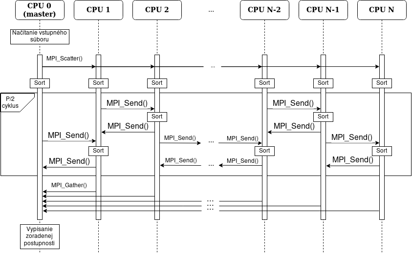
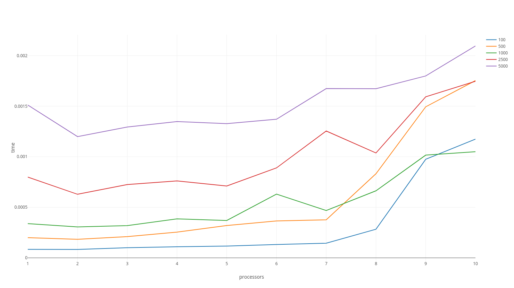

# Dokumentácia k 1. projektu PRL 2018
## Teória
### Algoritmus
[Merge-splitting sort](https://www.fit.vutbr.cz/study/courses/PDA/private/www/h003.pdf#page=19) je paralelný zoraďovací algoritmus podobný algoritmu [odd-even transposition sort](https://www.fit.vutbr.cz/study/courses/PDA/private/www/h003.pdf#page=12) a skladá z 2 hlavných častí. 

````php
for i = 1 to p do in parallel    (1)
    procesor P^i zoradí svoju úsek postupnosti sekvenčným algoritmom
endfor
for k = 1 to  [p/2] do    (2)
    for i = 1, 3, ... 2*[p/2] do in parallel   (3)
        spoj S^i a S^i+1 do jednej sekvencie K
        zoraď postupnosť K sekvenčným algoritmom
        S^i = prvá polovica K
        S^i+1 = druhá polovica K
    endfor
    for i = 2, 4, ... 2*[p/2] do in parallel   (4)
        spoj S^i a S^i+1 do jednej sekvencie K
        zoraď postupnosť K sekvenčným algoritmom
        S^i = prvá polovica K
        S^i+1 = druhá polovica K
    endfor
endfor
````
Prvou častou, ktorá je v pseudokóde označená ako (1), je predspracovanie. Súčasťou predspracovanie je distribúcia častí nezoradenej postupnosti jednotlivým procesorom. Následne každý procesor zoradí svoju časť sekvenčným zoraďovaním algoritmom.

Potom nasleduje merge-splitting časť (2). Táto časť sa opakuje p/2 krát, kde p je počet procesorov. Táto časť sa skladá z 2 pod-častí. V prvej pod-časti (3), procesory z nepárnym indexom získajú postupnosť od procesu s indexom o 1 väčší a spoja ju zo svojou časťou postupnosti. Potom túto postupnosť zoradia sekvenčným algoritmom a rozdelia na polovice. Nižšiu polovicu si nechajú a vyššiu polovicu pošlú susedovi. V druhej pod-časti (3) robia to isté procesory z párnym indexom.


### Zložitosť
Cena paralelného algoritmu je súčin počtu procesorov a časovej zložitosti, alebo `p(n) * t(n)`. Počet procesorov je pri tomto algoritme ľubovolný, ak platí že `p(n) < n`.

Časovú zložitosť môžme vydedukovať nasledovne:
* ak máme architektúru CREW alebo lepšie, možme nezoradenú postupnosť rozdistribuovať za `n/p`, čo je `O(n/p)`
* optimálny zoraďovací algoritmus má časovú zložitosť `O(n * log n)`, čo znamená že zoradenie vo fáze predspracovania má zložitosť `O((n/p * log (n/p))` a zoradenie zloženej postupnosti v merge-splitting fáze má zložitosť `O((2*n/p * log (2*n/p))`
* spojenie dvoch postupností `O(2*n/p)` lebo každý procesor má v sebe časť postupnosti veľkú `n/p` 
* preposlanie postupnosti medzi susedmi `O(n/p)` lebo každý procesor má v sebe časť postupnosti veľkú `n/p`

Z vyššie uvedeného a po zjednodušovaní nám výjde že časová zložitost tohto algoritmu je `O((n/p * log (n/p)) + O(n/p)`.
Celková cena potom je `(O((n/p * log (n/p)) + O(n/p)) * p`.

## Implementácia
Projekt pozostáva z 2 funkčných častí, shell skript a C++ implementácia merge-splitting sort. Shell skript je upravený [test.sh](http://www.fit.vutbr.cz/~ikalmar/PRL/odd-even-trans/test) skript z poskytnutých ukážkových súborov. Pridané bolo spracovanie a kontrola 2 vstupných argumentov a prepínač `--oversubscribe` k príkazu `mpirun`.

C++ implementácia merge-splitting sort je uložená v [mss.cpp](./mss.cpp). Implementácia je postavená na poskytnutom zdrojovom kóde [odd-even.cpp](http://www.fit.vutbr.cz/~ikalmar/PRL/odd-even-trans/odd-even.cpp) z niekoľkými dôležitými rozdielmi.

Prvou funkčnou častou je načítanie nezoradenej postupnosti zo súboru `numbers`. Celý obsah súbora `numbers` uložíme to poľa `numbers`. Ak je počet čísel v `numbers` nedeliteľný z počtom procesorov, tak sú na koniec poľa `numbers` pridané maximálne hodnoty typu `unsigned` tak, aby veľkosť poľa `numbers` a počtu procesorov boli súdeliteľné čísla. Následné je nezoradená postupnosť rozdelená medzi procesory pomocou funkcie `MPI_Scatter`.

Každý procesor zoradí svoju časť v časti predspracovania pomocou funkcie `sort`. Potom nasleduje merge-split časť algoritmu, ktorá je implementovaná pomocou cyklu ktorý je opakovaný polovicu počtu procesorov krát. Procesory si navzájom posielajú časti postupnosti pomocou funkcií `MPI_Send` a `MPI_Recv`. Na zoradenie spojenej postupnosti je použitá funkcia `merge`.

Po dokončení merge-split časti je nutné získať zoradenú postupnosť od všetkých procesorov. Na to je použitá funkcia `MPI_Gather`. Po získaní zoradenej postupnosti je táto postupnosť vypísaná a celý program končí.

## Komunikačný protokol
Moja C++ implementácia merge-splitting sortu používa nasledujúci komunikačný protokol.



## Experimenty
V experimentoch som meral dĺžku vykonávania algoritmu bez výpisov. Konečný výsledok bol zistený spriemerovaním výsledkov zo 100 behov.


## Záver
Z experimentov je možný vidieť posun výkonnostného optima pri zvyšujúcom sa počte prvkov nezoradenej postupnosti. Pri 100 prvkov leží optimum niekde medzi 1 a 2, zatiaľ co pri 5000 už leži niekde pri 2 a 3. To zodpovedá našim predpokladom, a to že optimálny počet procesorov je nižší ako log(n), kde n je počet prvkov postupnosti. Ak je počet procesorov vyšší, algoritmus bude neoptimálny kvôli zvyšujúcej sa cene komunikácie medzi procesormy, čo je krásne vidieť v pravej časti grafu.
