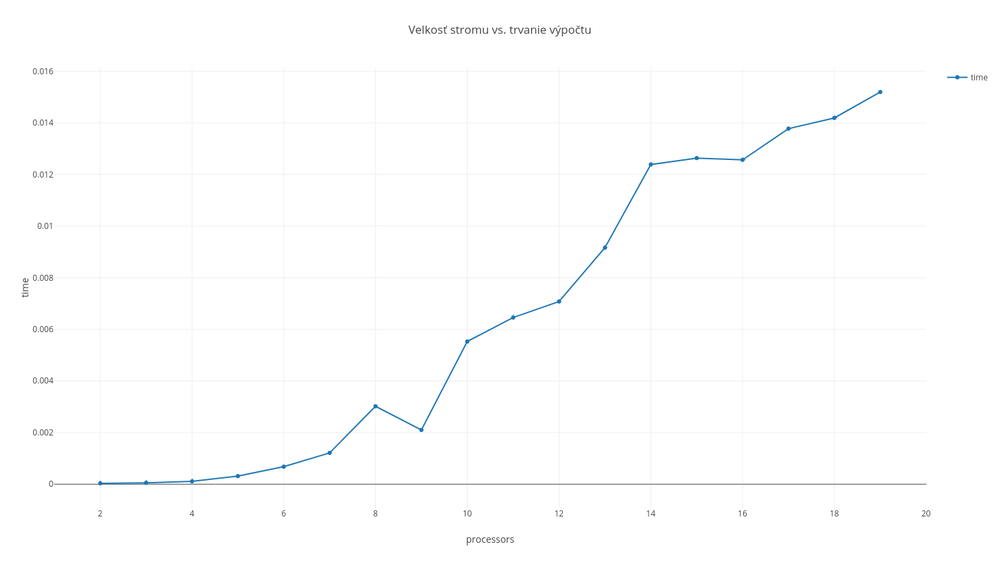

# PLR projekt 3 - Přiřazení pořadí preorder vrcholům

## Teória

Obecný výpočet v strome má nasledujúce kroky:
1. Vytvorenie eulerovej cesty.
2. Vytvorenie poľa hodnôt.
3. Spočítanie sumi suffixov nad týmto poľom.
4. Korekcia.

Vytvorenie eulerovej cesty je podrobne vysvetlené [tu](https://www.fit.vutbr.cz/study/courses/PDA/private/www/h007.pdf#page=25). Eulerova cesta je cesta ako navštíviť všetky uzly grafu tak, aby sme po každej hrane prešli len raz.    

Vytvorenie poľa hodnôt je jednoduché. Dopredné hrany majú hodnotu 1 a ostatné 0. 

Suma suffixov je podobná sume prefixov ale aplikovaná na stromové štruktúry, resp. grafy. Pri tejto sume si jednotlivé procesory 2 hodnoty. Prvou je `weight` opýtaného procesoru, ktorú procesor pripočíta k svojej `weight`. Druhou ukazovateľ na nasledovníka opýtaného procesoru. Tento ukazovateľ ukazuje na procesor, ktorého dáta budeme žiadať v nasledujúcom cykle. To spôsobuje, že každý procesor skáče o viac a viac procesorov, vďaka čomu vieme sumu suffixov vypočítať v `log n`. Posledný procesor ma ako následníka vždy sám seba, aby ostatné procesory neskákali mimo.

Potom nasleduje už len korekcia. Výsledné indexy sú len v dopredných hranách. `Weight` jednotlivých hrán je invertovaná hodnota výsledku, preto je výsledok rovný `n - weigth(ID)`. Root ma hodnotu 0.

Počet procesorov nutných pre tento algoritmus vypočítame pomocou rovnice `p=2*n-2`, čo znamená že procesorová náročnosť je **n**.

Časová náročnosť sa dá odvodiť nasledovne:
* Výpočet eulerovej cesty sa dá spočítať v konštantnom čase, lebo každý procesor si dokáže materializovať svoju časť potrebnú pre výpočet. V CREW a lepších architektúrach si tiež vedia poskladať procesory eulerovu cestu z medzi-výsledkov v konštantnom čase. Zložitosť je teda **c**.
* Vytvorenie poľa hodnôt je taktiež možné v konštantnom čase, v mnohých prípade za 1. Zložitosť je **c**.
* Suma suffixom trvá obecne log n, čo je spôsobené tým, že každý cyklus sa skáče o viac prvkov prvkov eulerovej cesty. Zložitosť je teda **log n**.
* Korekciu je možné vykonať v konštantnom čase, zložitosť je teda **c**.
Z týchto úvah nám vyjde že `t(n) = c * c * c * log n` čo je `t(n) = O(log n)`.

Celková cena algoritmu je `c(n) = t(n) * p` čo po dosadení je `c(n) = n * log n`.

## Implementácia
Implementácia sa skladá z 2 častí. Shell skriptu `test.sh`, ktorý je použitý na vybuildovanie a spustenie preorder programu a `pr.cpp`, čo je C++ implementácia paralelného hľadania preorder poradia v binárnom strome.

C++ časť programu začína načítaným vstupu. Ak je dĺžka vstupu menšia ako 1, program sa rovno ukončí a vypíše nezmenený vstup na `stdout`. Ak je dĺžka vstupu dlhšia ako 1, pokračuje sa ďalej.

Každý procesor v tomto programe reprezentuje 1 hranu v grafe, preto je dôležité vedieť odkiaľ a kam daná hrana ukazuje. To sa zisťuje pomocou rovníc `myid/4` a `myid/2 + 1` pre kam a odkiaľ smeruje daná hrana. Ak má procesor nepárne ID, tak to znamená že to nie je dopredná hrana, čo spôsobí že sa vymenia miesta kam a odkiaľ hrana ide.

Následne sa započne hľadanie [eulerovej cesty](https://www.fit.vutbr.cz/study/courses/PDA/private/www/h007.pdf#page=25). Prvou fázou je vytvorenie tkz. `adjecancy listu`. Každý procesor si v záujme optimalizácie vytvorí len tú časť `adjecancy listu`, ktorú bude potrebovať pre nájdenie eulerovej cesty.

Potom vytvorení `adjecancy listu` nasleduje fáza hľadania následníka, ktorého algoritmus je zachytený [tu](https://www.fit.vutbr.cz/study/courses/PDA/private/www/h007.pdf#page=24). Potom máme problém, že každý procesor má len svoju časť eulerovej cesty. To vyriešime pomocou funkcie `MPI_Allgather`, ktorá spôsobí, že každý procesor bude mať celú eulerovu cestu.

Ďalej vypočítame opačnú eulerovu cestu. To je potrebné pre sumu suffixov, keďže potrebujeme vedieť koľko krát bude niekto od daného procesoru niečo žiadať. Tá sa vypočíta tak, že každý procesor pošle svojmu následníkovi v eulerovej ceste svoje ID a potom si pomocou `MPI_Allgather` pošlú svoje časti opačnej eulerovej cesty.

Po týchto krokoch začne hľadanie poradia preorder vrcholov. Obecný postup je vysvetlený [tu](https://www.fit.vutbr.cz/study/courses/PDA/private/www/h007.pdf#page=30). Pri implementácií je zaujímavý spôsob akým medzi sebou komunikujú jednotlivé procesory. Každý procesor, ak už nie je na konci eulerovej cesty, najprv pošle požiadavku procesoru od ktorého chce jeho `weight` a ID jeho následníka. V tejto požiadavke je jeho ID a ID jeho predchandu v eulerovej ceste. Potom, ak ešte existuje niekto, kto by chcel od neho informácie, sa uspí a čaká kto s ním naviaže spojenie. Tomu pošle svoju `weight` a ID následníka. Toto trvá až kým procesor z ID 0 neprejde až na koniec eulerovej cesty.

Následne je urobená korekcia. Po nej procesory reprezentujúce dopredné hrany pošlú vrchol kam vedú procesu z ID mieste v preorder ceste kam daný vrchol patrí. Následne procesor z ID 0 zozberá celú preorder cestu pomocou `MPI_Gather` a vypíše ju na `stdout`.

## Komunikačný protokol

## Experimenty
Experimenty boli robené na stromoch z dĺžkou 1 až 20. Pre každú dĺžku stromu bolo vykonaných 100 experimentov, ktorých trvanie bolo spriemerované.

## Záver

Z grafu môžme vidieť že reálny graf nezodpovedá tomu, že teoretický algoritmus má časovú náročnosť **log n**. To môže byť spôsobené mnohými faktormi, napríklad neoptimálnym programom, tým že použitý procesor nemá vždy `2n - 2` reálnych procesorov, takže sa čas stráca prepínaním kontextu. Ďalším dôvodom môže byť to, že sa zvyšuje čas ktorý trávia procesory komunikovaním. Taktiež použitie bariér v sume suffixov môže spôsobovať zdržanie, lebo 1 pomalý procesor spomalí všetky ostatné.

Reálnym dôvodom prečo implementácia teoretického algoritmu nemá optimálnu časovú náročnosť je asi spojenie všetkých vyššie uvedených dôvodov.